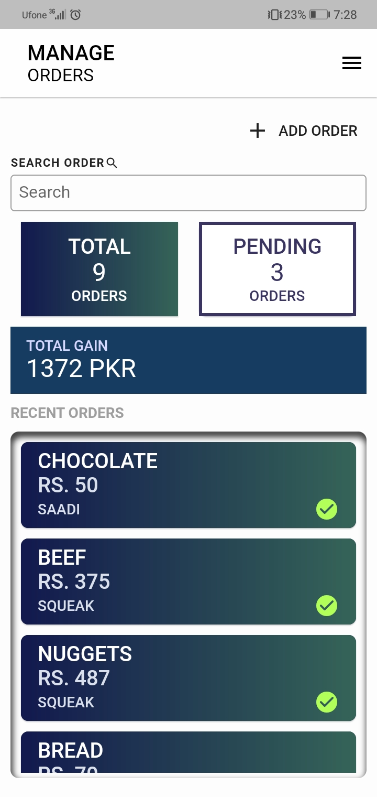
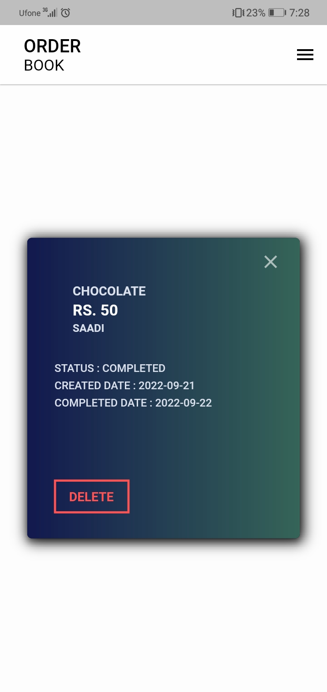
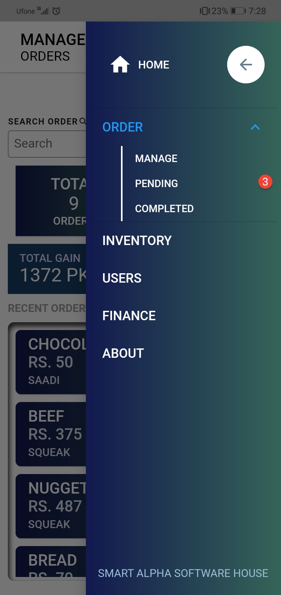
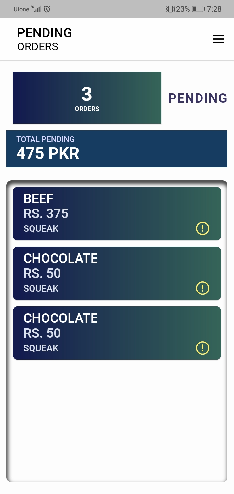
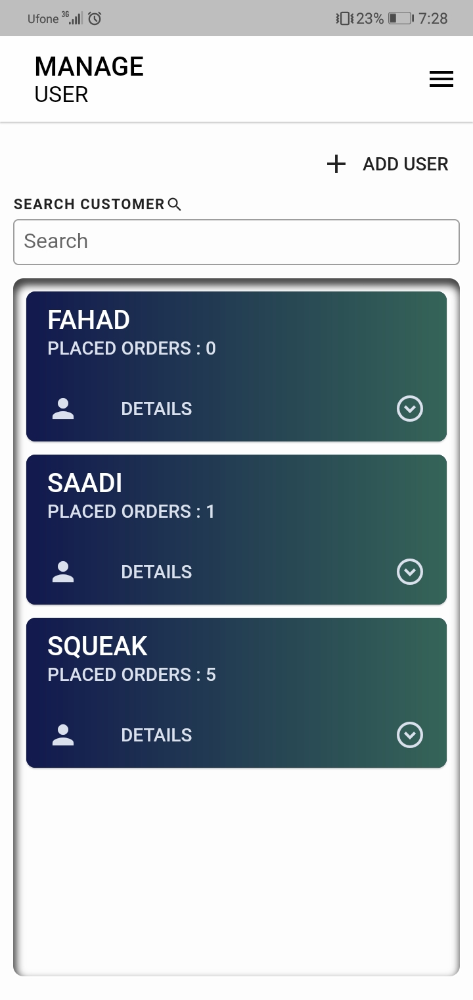
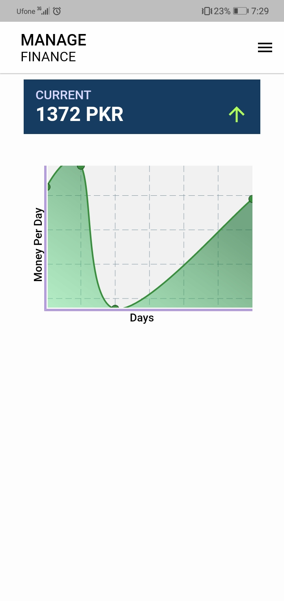
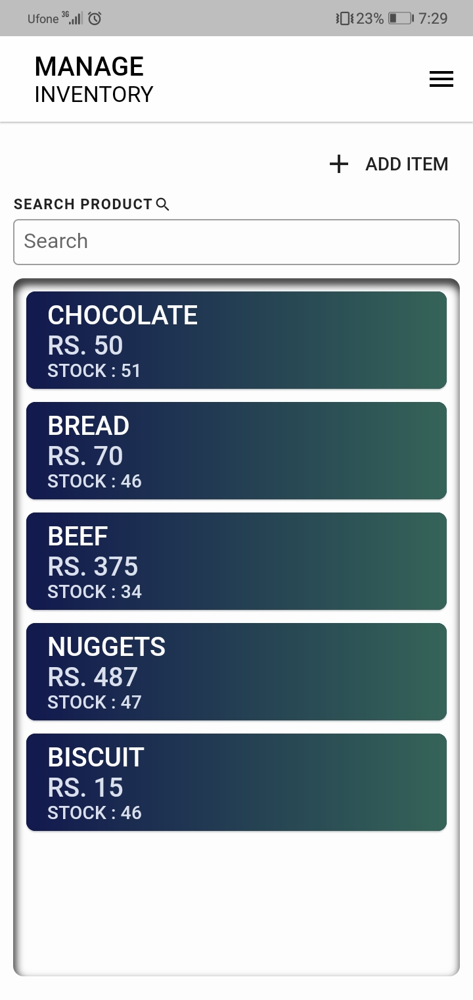

# KHAATA 
> Khaata is an inventory tracking and stock management application designed for local small businesses and shops to manage their stocks, customers and their orders.

## **Development Progress :**


## Task-List
- [x] Bloc (Cubit)
- [ ] UI Responsiveness
- [ ] Profiling and Optimization
- [ ] Refactoring
- [ ] Unit Testing
- [ ] Documentation 

## Project Dependencies

- build_runner: 2.2.0
- introduction_screen: 3.0.2
- hive_generator: 1.1.3
- hive: 2.2.3
- hive_flutter: 1.1.0
- flutter_inset_box_shadow: 1.0.8
- fl_chart: 0.55.1
- equatable: 2.0.3
- badges: 2.0.3
- bloc: 8.1
- flutter_bloc: 8.0.1.0

## #Custom Widgets:
#### 1. CustomOutlinedButton :
```dart
CustomOutlinedButton(
              text: "Click",
              onPressed: () {},
            );
```
#### 2. CustomAppBar
```dart
    CustomAppBar(
      title: Text("Title"),
      subtitle: Text("subTitle"),
    );
```
#### 3. CustomCard
```dart
    CustomCard(
      height: 50,
      width: 100,
      shadow: true,
      child: Text("Card Text"),
    );
```
#### 4. CustomTextField
```dart
CustomTextField(
            controller: controller,
            contentPadding: 10,
            color: Colors.black,
            inputType: TextInputType.number,
            isDense: true,
            onChanged: (value) {},
          );
```


## #Build Previews:
<div style="display: flex;">
  
  
  
  
  
  
  
  
</div>


