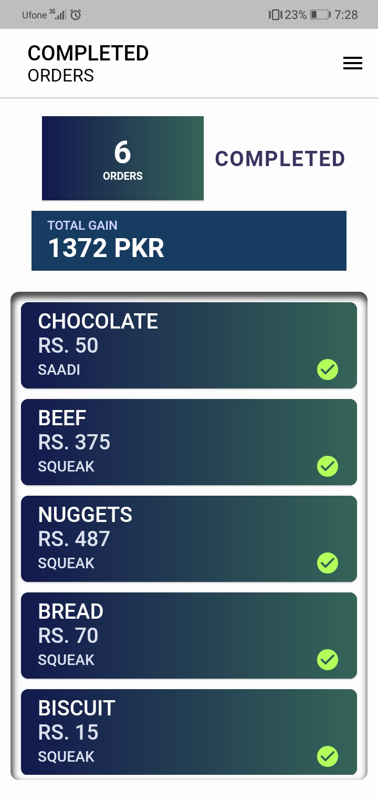

# KHAATA 
- **Status:** under-development
- **Version:** 1.0.3 (ALPHA)
- **Description:** *Project Description here. . .*

## **Development Branches**
- update-1.2.4 (in-progress)

## **Development Progress :**


## **Task-List**
- [x] Bloc Pattern
- [ ] Refactoring
- [ ] Unit Testing
- [ ] Profiling and Optimization
- [ ] Documentation 

## 1. **Project Dependencies:**

- build_runner: 2.2.0
- introduction_screen: 3.0.2
- hive_generator: 1.1.3
- hive: 2.2.3
- hive_flutter: 1.1.0
- flutter_inset_box_shadow: 1.0.8
- fl_chart: 0.55.1
- equatable: 2.0.3
- badges: 2.0.3
- bloc: 8.1
- flutter_bloc: 8.0.1.0

## Bugs:
***If you have found and bugs, please document below here.***
- [] found issue/bug

## 2. **Project Structure and Guidelines:**

- <a href="https://dart.dev/guides/language/effective-dart/style" target="_blank">Coding Guidelines</a>
- **According to flutter docs, prefer **classes** over **methods** for widget separation and for better widget tree optimization.**

## 4. **Custom widget classes:**
#### 1. CustomOutlinedButton :
```dart
CustomOutlinedButton(
              text: "Click",
              onPressed: () {},
            );
```
#### 2. CustomAppBar
```dart
    CustomAppBar(
      title: Text("Title"),
      subtitle: Text("subTitle"),
    );
```
#### 3. CustomCard
```dart
    CustomCard(
      height: 50,
      width: 100,
      shadow: true,
      child: Text("Card Text"),
    );
```
#### 4. CustomTextField
```dart
CustomTextField(
            controller: controller,
            contentPadding: 10,
            color: Colors.black,
            inputType: TextInputType.number,
            isDense: true,
            onChanged: (value) {},
          );
```


## 3. **Build Preview:**


<br/>
<br/>

<br/>
<br/>

<br/>
<br/>

<br/>
<br/>

<br/>
<br/>

<br/>
<br/>

<br/>
<br/>


